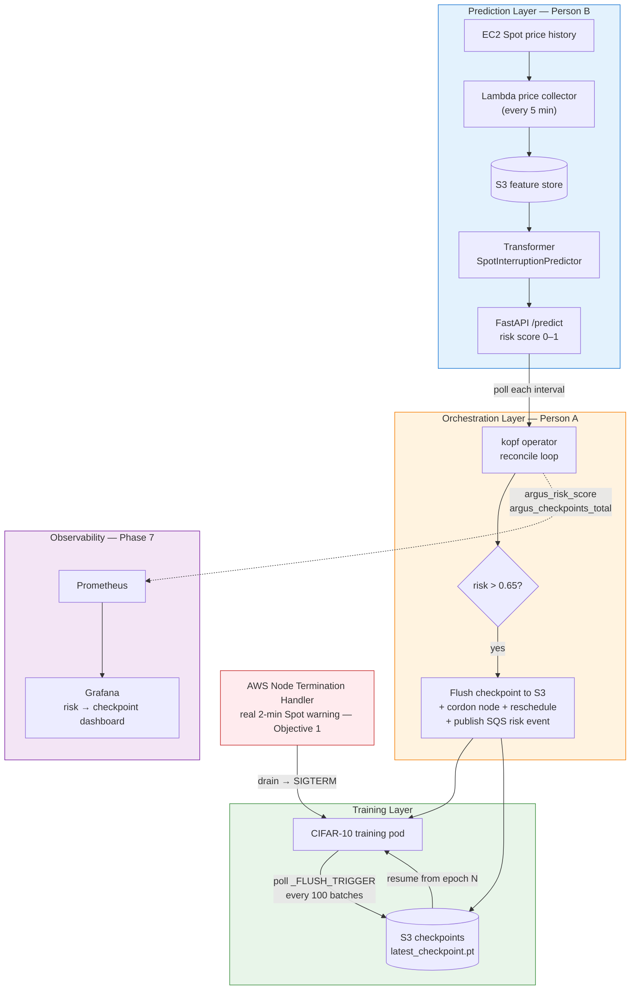
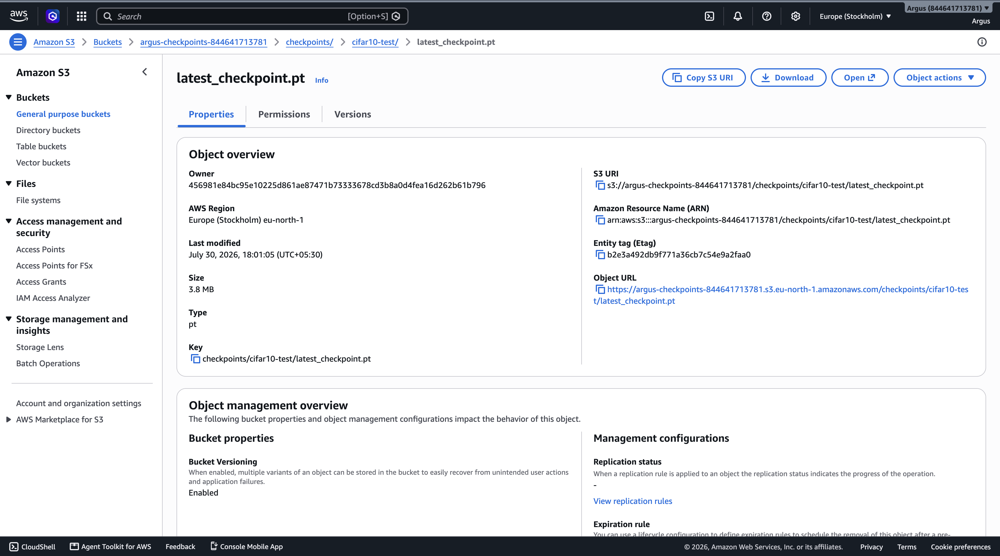
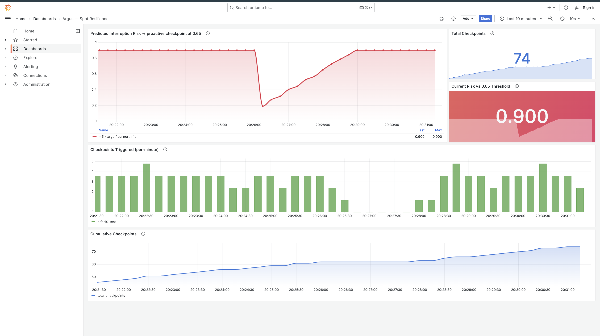

# Argus — Spot-Resilient ML Training Orchestrator

A three-layer system that predicts EC2 Spot interruptions before they happen and automatically checkpoints + migrates running ML training jobs — zero human intervention. **Validated end-to-end on real AWS EKS.**

> **Status: complete (Weeks 1–8).** Live-EKS interruption survival captured, a controlled benchmark quantifies when prediction pays, the risk model is trained/calibrated/characterized, and the whole loop is observable in Grafana. Targeting a NeurIPS ML4Sys 2026 workshop poster.

---

## Architecture



**Two interruption paths converge on the same SIGTERM → checkpoint → reschedule → resume flow:** the *predictive* path (operator sees risk cross the threshold and pre-migrates) and the *reactive* path (AWS's real 2-minute Spot warning via the Node Termination Handler — validated on real EKS in Objective 1).

---

## The problem

EC2 Spot instances are ~70–90% cheaper than On-Demand but can be reclaimed on **2 minutes' notice**. A long ML training job that ignores this loses everything since its last checkpoint on every interruption — wasted GPU-hours and a non-deterministic finish time. Argus keeps the job alive across reclaims automatically.

## How it works

| Layer | What it does |
|-------|--------------|
| **1. Prediction** (Person B) | Lambda pulls Spot price history every 5 min → S3 feature store → a Transformer scores interruption risk → served via FastAPI `/predict`. |
| **2. Orchestration** (Person A) | A `kopf` Kubernetes operator (the `SpotResilientJob` CRD) polls `/predict`; when risk crosses `0.65` it writes a `_FLUSH_TRIGGER` to S3, cordons the node, reschedules the pod, and publishes an SQS risk event. |
| **3. Training** | The CIFAR-10 job polls the trigger every 100 batches and saves `model.pt`; a SIGTERM handler checkpoints on drain; the replacement pod resumes from the last epoch. |

The checkpoint mechanism is deliberately **decoupled** — the operator only *signals*; the training pod owns the flush — so the operator never touches training-process internals.

---

## Results

### Objective 1 — Survived a real Spot drain on real EKS

Validated on **real Spot nodes** (`c5.xlarge`/`m5.xlarge`) with IRSA (zero static credentials) and the AWS Node Termination Handler in queue mode. Training was live at **epoch 7** when the interruption fired:

| t (UTC) | Event |
|---------|-------|
| 12:26:18 | NTH receives `EC2 Spot Instance Interruption Warning` |
| 12:26:19 | Requesting drain → evicting pod `cifar10-test` (graceful SIGTERM) |
| 12:26:19 | SIGTERM handler **writes checkpoint (epoch 8) to S3** |
| 12:26:25 | Node cordoned + drained — **10 s** end-to-end |
| +~75 s | Replacement pod on a healthy node → **"Resuming from epoch 8"** |

Only the in-progress epoch's work was lost. The real checkpoint written to S3 during the drain:



> **Honest scope:** the interruption was delivered by injecting a **schema-conformant** `EC2 Spot Instance Interruption Warning` into NTH's queue — NTH cannot distinguish it from a real reclaim, so the drain → SIGTERM → checkpoint → resume path is genuinely exercised. A *forced* AWS reclaim (FIS `send-spot-instance-interruptions`) is future work, blocked on an account-subscription issue, not the design. See [`docs/objective1_result.md`](docs/objective1_result.md) and ADR-007 / P-019 in [`docs/problems_and_decisions.md`](docs/problems_and_decisions.md).

### Objective 2 — When does prediction actually pay?

A controlled benchmark (4 arms × 4 interruption rates × 5 reps = **80 trials**, Poisson-scheduled kills). Wasted compute at the fastest rate (MTBF = 120 s):

| Arm | Wasted compute (s) | Recovery (s) |
|-----|-------------------:|-------------:|
| no-protection | 202.3 | — |
| reactive-on-notice | 169.4 | 58.8 |
| periodic | 4.3 | 65.7 |
| **predictive (Argus)** | **0.0** | **5.4** |

The argument the paper rides on: **reactive's fixed 2-minute notice stops helping exactly when interruptions come faster than once per ~2 min** (at 120 s MTBF the notice ≈ the interval, so reactive degrades toward no-protection). Predictive's clean wins are **zero wasted compute** and **~12× faster recovery** (5.4 s vs 65.7 s). Honestly noted: *periodic* checkpointing is a strong ML-free baseline on wasted compute, and predictive's zero relies on an assumed lead time — see the write-up. Full table + figures: [`docs/objective2_result.md`](docs/objective2_result.md), [`benchmark/results/`](benchmark/results/).

### Objective 3 — The risk model (honest secondary result)

Transformer on live `eu-north-1` Spot price history. After fixing the bugs that made it useless (train/serve scaler skew — the original flat `0.0419`; train/val leakage; a no-op FocalLoss `alpha`; missing calibration): **14.68× base-rate lift, 5-seed mean, 95% CI ≈ [9.9×, 19.5×]** — on a **proxy label** (price spikes), not real reclaims. Presented as an **advisory** signal; the ceiling is label quality, and real interruption ground truth is future work. Details: [`docs/objective3_result.md`](docs/objective3_result.md).

### Observability

The operator emits Prometheus metrics (`argus_risk_score`, `argus_checkpoints_total`, `argus_jobs_completed_total`); a provisioned Grafana dashboard shows predicted risk climbing across the `0.65` threshold and the proactive checkpoint firing at that instant:



Run it: `./scripts/monitoring.sh up` → `./scripts/monitoring.sh open`. See [`docs/A6_observability.md`](docs/A6_observability.md).

---

## Honest limitations

- **Objective 1** used an *injected* (schema-conformant) reclaim, not an AWS-issued FIS reclaim.
- **Objective 2** predictive's zero-waste assumes ~5 min reliable lead time — a benchmark parameter, not a measured property of the trained model; the training job is synthetic (mechanics, not SOTA accuracy).
- **Objective 3** is measured on a proxy label (price spikes), so the model is advisory, not automation-grade.
- Real Spot on the primary account was gated by a Free-Tier restriction for most of the build (ADR-005), so Week-6 nodes were On-Demand.

Owning these is the point — see the framing in [`docs/poster_blueprint.md`](docs/poster_blueprint.md).

---

## Repository structure

```
Project/
├── terraform/          # All AWS infra (VPC, S3, SQS, IAM, EKS, IRSA, ECR)
├── lambda/             # Spot price collector (EventBridge cron → S3)
├── operator/           # kopf Kubernetes operator + SpotResilientJob CRD
├── ml/                 # Transformer model, FastAPI predict service, CIFAR-10 job, label pull
├── benchmark/          # Objective 2 harness, arms, results, figures
├── helm/argus/         # Helm chart (operator + metrics Service)
├── k8s/monitoring/     # Prometheus + Grafana (Phase 7)
├── demo/               # SpotResilientJob + training-pod + mock-predict manifests
├── scripts/            # objective1_real_spot.sh, monitoring.sh, verify_teardown.sh
├── localstack/         # Local AWS simulator for offline dev
├── .github/workflows/  # CI/CD (build always; deploy gated on cluster existing)
└── docs/               # Objective results, decisions log, ADRs, poster blueprint, figures
```

## Reproduce

```bash
# --- Local dev (offline, free) ---
cd localstack && docker compose up -d          # LocalStack S3/SQS
bash minikube/setup.sh                          # CRD + RBAC on minikube

# --- Benchmark (Objective 2, no cloud needed) ---
python benchmark/harness.py --reps 5 --step-budget 500 --step-time-sec 0.3
python benchmark/aggregate.py                   # -> benchmark/results/

# --- Observability stack (minikube) ---
helm upgrade --install argus ./helm/argus --namespace default
./scripts/monitoring.sh up && ./scripts/monitoring.sh open

# --- Real EKS interruption drill (Objective 1) ---
./scripts/objective1_real_spot.sh spot-up       # Spot node group + IRSA re-wire
./scripts/objective1_real_spot.sh nth-queue     # Node Termination Handler
./scripts/objective1_real_spot.sh inject        # schema-conformant interruption
./scripts/objective1_real_spot.sh evidence
```

## Cost safety

The primary account has spotty billing guardrails, so **every session ends with a sweep**:

```bash
./scripts/verify_teardown.sh    # all-region check for anything billable; exit 0 = clean
```

Born from a \$66 EKS cluster left running unnoticed. EKS/NAT are hourly billers — always tear them down; S3/SQS/Lambda are effectively free and stay up.

---

## Roadmap — all complete

| Week | Person A (Infra / Operator) | Person B (ML / API) |
|------|-----------------------------|---------------------|
| **1–3** | ✅ Terraform infra (VPC, S3, SQS, IAM), Lambda price collector, EKS control plane + IRSA + ECR | ✅ Spot data + EDA, feature pipeline, Transformer trained (Focal Loss, MLflow, tuning) |
| **4–5** | ✅ `SpotResilientJob` CRD + kopf operator, full reconcile loop, Minikube integration test passed | ✅ FastAPI `/predict`, CIFAR-10 job with S3 checkpoint/resume + SIGTERM handler |
| **6** | ✅ Deployed to **real EKS** — Helm operator, IRSA, live migration chain end-to-end, torn down to \$0 | ✅ Real model + predict-service on EKS, real checkpoint to S3, resume validated |
| **7** | ✅ Prometheus + Grafana observability, CI/CD guarded | ✅ Metrics instrumented in the reconcile loop |
| **8** | ✅ Objective 1 (real-EKS survival), README + architecture diagram, poster blueprint | ✅ Objective 2 (benchmark), Objective 3 (model characterized, 14.7× proxy lift) |

## Authors

- **Person A** — cloud/infrastructure: Terraform, EKS, the Kubernetes operator, CI/CD, observability, real-Spot interruption drill.
- **Person B** — machine learning: feature pipeline, the Transformer risk model, FastAPI predict service, CIFAR-10 training job, benchmark harness.

## Documentation index

- [`docs/objective1_result.md`](docs/objective1_result.md) — real-EKS interruption survival
- [`docs/objective2_result.md`](docs/objective2_result.md) — benchmark harness + full sweep
- [`docs/objective3_result.md`](docs/objective3_result.md) — prediction model, 4 rounds
- [`docs/A6_observability.md`](docs/A6_observability.md) — Prometheus + Grafana
- [`docs/problems_and_decisions.md`](docs/problems_and_decisions.md) — every problem (P-0xx) + ADRs
- [`docs/poster_blueprint.md`](docs/poster_blueprint.md) — the 4-page poster plan
- [`docs/contracts.md`](docs/contracts.md) — the A↔B integration contracts
