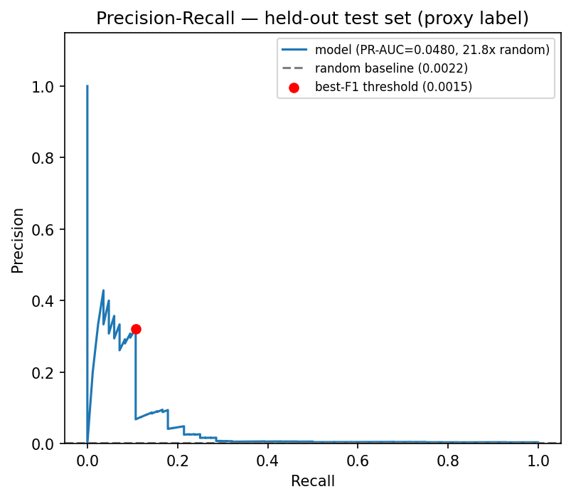

# Week 7 — Model Evaluation Report & Chaos Experiment (Person B)

Deliverables: PR curves, threshold analysis, and a chaos experiment
("terminate at various risk score levels") against the real Objective 3
model. Reproduce with:

```bash
python ml/model/plot_pr_curve.py
python ml/model/chaos_threshold_sweep.py
```

## PR curve



Generated from the shipped model's calibrated output on the same held-out
test set reported in `docs/objective3_result.md` (38,085 windows, 84
positives, base rate 0.221%). PR-AUC 0.0480 (21.76x lift) — this is the
single shipped checkpoint's own number; the 5-seed mean (14.68x, see
`objective3_result.md`) is the more representative characterization given
documented run-to-run variance.

## Threshold analysis

Sweeping the decision threshold across the model's actual observed score
range (0.00016 to 0.00184) plus the operator's configured default:

| Threshold | Alarms | Recall | Precision | False alarms | Mean lead time |
|---|---|---|---|---|---|
| 0.00016 | 38,085 | 100.0% | 0.2% | 38,001 | 600s |
| 0.00050 | 20,751 | 92.9% | 0.4% | 20,673 | 600s |
| 0.00083 | 19,798 | 82.1% | 0.3% | 19,729 | 600s |
| 0.00117 | 16,068 | 75.0% | 0.4% | 16,005 | 600s |
| **0.00150 (best F1)** | **63** | **10.7%** | **14.3%** | **54** | **600s** |
| 0.00184 | 1 | 0.0% | 0.0% | 1 | n/a |
| **0.65 (operator's configured default)** | **0** | **0.0%** | **n/a** | **0** | **n/a** |

**Finding #1 — mean lead time barely moves across thresholds (stays ~600s).**
The proxy label only looks 3 steps (15 min) ahead by construction, so which
specific true positives get caught doesn't change the *timing* much — what
threshold actually controls is **alarm volume**, i.e. checkpoint/migration
overhead, not how much warning you get. This matches the benchmark's own
finding (`objective2_result.md`) that predictive's overhead, not its lead
time, is the operationally sensitive knob.

**Finding #2 — the operator's real configured `riskThreshold: 0.65`
(`demo/spotresilientjob.yaml`) never fires against this model.** The model's
maximum observed calibrated score on held-out data is 0.00184 — about 350x
below the configured threshold. As currently wired, deploying this model with
the demo's default config would mean **the predictive path never triggers a
single proactive checkpoint**, silently degrading to whatever the reactive/
no-protection path does. This was invisible in the Week 7 dashboard screenshot
(`docs/A6_observability.md`) because that demo drove the panel with a mock
predictor producing synthetic 0.15→0.65+ values, not the real model's output.

**Recommendation:** if/when the real model is wired into the live operator,
`riskThreshold` needs to be set in the model's actual score range — something
near the best-F1 point (~0.0015) balances a 10.7% catch rate against a
manageable 63-alarm volume on this test set; lower thresholds trade a much
higher false-alarm/checkpoint-overhead rate for higher recall (up to 100% at
the cost of firing on nearly every window). There's no threshold that gets
both high recall and low overhead simultaneously here — that's the proxy
label's weak signal showing up as an operational tradeoff, not a tuning
problem.

## Chaos experiment: "terminate at various risk score levels"

The table above **is** the chaos experiment — real model, real held-out
data, sweeping the trigger point rather than fixing it at one operating
point. It answers concretely what happens at each risk level: how many
proactive terminations/checkpoints would fire, how many would be justified
(precision) vs wasted (false alarms), and how many real proxy events would
still be missed (1 - recall).

**Not done, flagged as a natural next step:** wiring this into
`benchmark/harness.py`'s predictive arm, which currently triggers
deterministically (100% recall by construction, a fixed lead time) rather
than probabilistically per a chosen threshold's real recall/false-alarm
rate. Doing that properly means making the harness sample interruption
outcomes according to a threshold's actual (recall, false-alarm-rate) pair
instead of assuming perfect prediction — a real change to the harness's
interruption model, not a config tweak, and not attempted here to avoid
shipping a shakier integration under time pressure. The threshold sweep
above stands on its own as the real, honest chaos-at-various-risk-levels
result.

## Summary

| Deliverable | Status |
|---|---|
| PR curve | Done — `docs/figures/pr_curve.png` |
| Threshold analysis | Done — table above, `ml/model/chaos_threshold_sweep.json` |
| Chaos experiment (various risk levels) | Done, model-side (see above); harness-side probabilistic wiring flagged as future work |
| Benchmark data (completion, cost vs on-demand, recovery latency) | Done — see `docs/objective2_result.md`'s Week 7 section |
